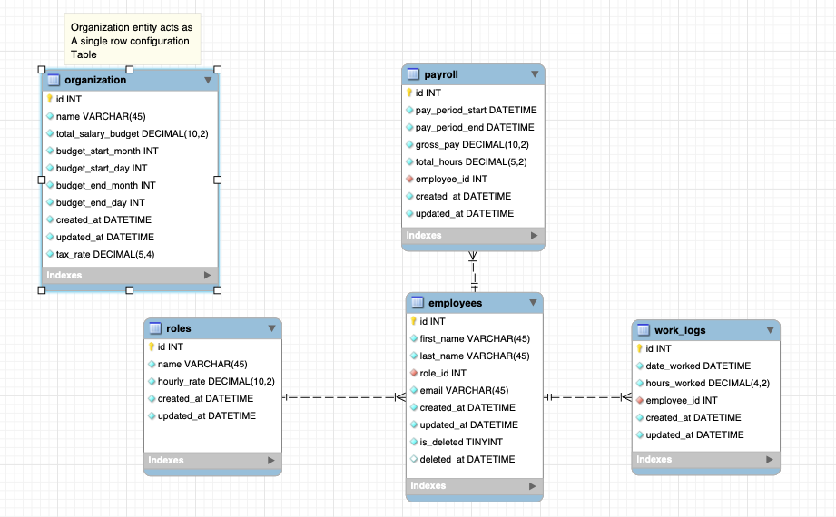

# Overview on Project Structure

## Architecture

- Backend: Python (Flask)
- DB: MySQL 8 (via Podman)
- ORM: SQLAlchemy (via Flask Migrate)

## Schema and ERD

    

## Data lifecycle

> [!NOTE]
> Current design is not set and is constantly being revised

Yuzu proccesses payrolls by compiling employee work logs and finalizing them into an immutable payroll record
- **Work logs** track when an employee works and the number of hours during their shift
- These logs are then referenced by the payrolls through a join table, `payroll_worklogs`, which records the associated hours for auditing and traceability
- **Payroll records** remain mutable while in `DRAFT` status, and its contents are dynamically calculated from the associated work logs
- Once all relevant work logs used in a payroll are locked, the latter can be **finalized**. This:
    - locks the payroll and its linked work logs
    - flags the associated payroll in `payroll_worklogs.snapshot_locked` as `true`
    - prevents any further modifications or deletions

## Payroll Generation Process

1. Generate work logs
2. Optionally lock work logs early to preserve their state
3. Create a draft payroll record (a shell)
4. Select work logs within a target date range
5. Make any necessary edits while the payroll is in draft
6. Finalize the payroll - locking both the payroll and associated work logs

> [!IMPORTANT]
> Finalization is only permitted if all linked work logs are locked. This guarantees consistency and data integrity across historical records

## Current concerns regarding this process

TBA